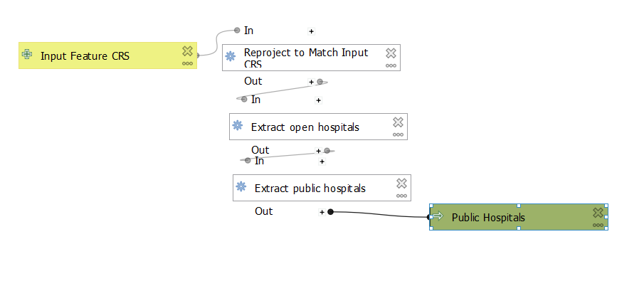
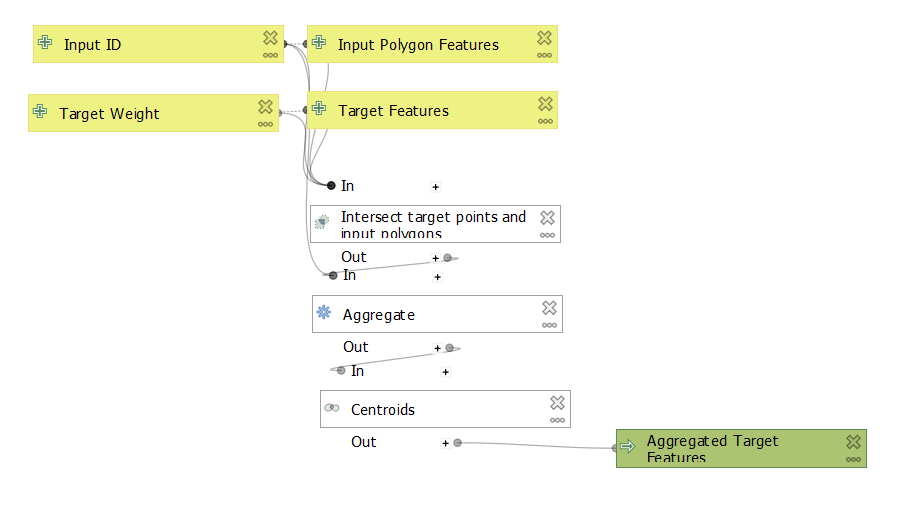
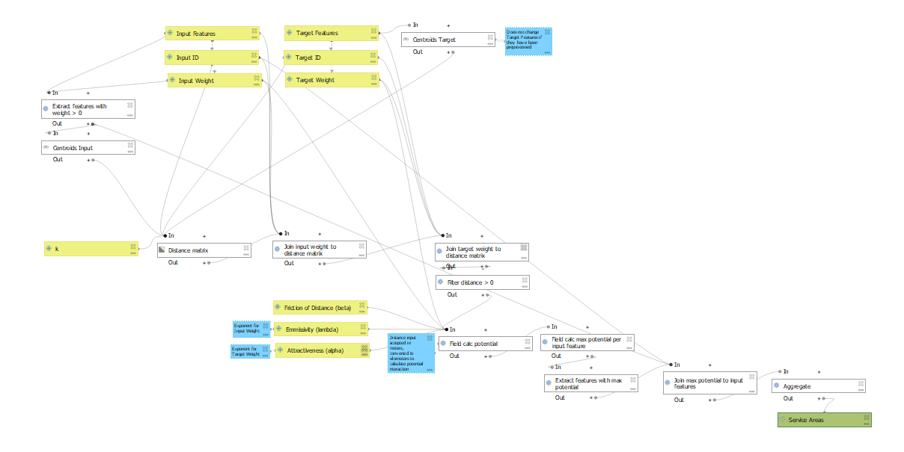

## Purpose and Overview

This collection of QGIS models implements a gravity model of spatial interaction. The models are implemented around a case study of hospital service regions in the northeastern United States, but could be applied to any number of similar spatial interaction processes. Results can be accessed via [web map](assets/web_map)

The core gravity model is adapted from that described in <a href="https://transportgeography.org/contents/methods/spatial-interactions-gravity-model/">The Geography of Transport Systems</a> (Rodrigue). It accepts as input two sets of vector features, one representing the source features and the other representing the target features, and produces as output a single vector layer representing the likely zone of influence that each target feature occupies. The potential for interaction between any pair of source and target features is calculated based on user-specified weight fields for the source and target features and the distance between the two features.

## Preprocessing
I built and tested this model with the aim of simulating hospital service areas in the northeast. Raw data is drawn from a <a href="https://hifld-geoplatform.opendata.arcgis.com/datasets/6ac5e325468c4cb9b905f1728d6fbf0f_0">Department of Homeland Security dataset</a> of U.S. hospital locations, and includes hospitals that maybe closed, missing important data on the number of beds, or not available for routine public use, such as military or psychiatric hospitals. These hospitals should be excluded from the calculation of service areas since they serve a specific small subset of the people in the surrounding area, and I filter them out of the original dataset using the following model. 

|Hospital Data Preprocessing|
|:---:|
||
|*This model is specific to the Homeland Security hospitals data and is not applicable to other data sources.*|

The filtered hospital locations (the target features) are then aggregated by the town in which they are located (the source features) so that they better match the spatial units of the source layer. For each town containing at least one hospital, hospital clusters are collapsed into a single point at the center of the cluster containing the sum of the desired target weight field - in this case the number of beds in each hospital - using the following model. 

|Target Feature Preprocessing|
|:---:|
||
|*This model can be generalized to any set of source and target features.*|

## Gravity Model Details
The gravity model accepts as input two sets of vector features, one representing the source features and the other representing the target features, and produces as output a single vector layer representing the likely zone of influence that each target feature occupies. Each input layer must have at least two fields: one that uniquely identifies each feature and one that contains a weight value for each feature. The potential for interaction between any pair of source and target features is calculated based the following formula:
(sourceWeight)^&lambda; * (targetWeight)^&alpha; / (distance)^&beta;
where &lambda, &alpha, and &beta are constant parameters used to customize the behavior of the model, as described in <a href="https://transportgeography.org/contents/methods/spatial-interactions-gravity-model/">The Geography of Transport Systems</a> (Rodrigue).

Each source feature is assigned to the target feature with which it has the most potential interaction, and the final service areas are created by grouping towns that share a target feature, as in the following model. 

|Gravity Model|
|:---:|
||
|*This model can be generalized to any set of source and target features.*|

## Results
We can loosely assess the quality of the model by comparing the [hospital service areas](assets/web_map) produced by the gravity model to those provided by the [Dartmouth Healthcare Atlas](https://atlasdata.dartmouth.edu/downloads/supplemental#boundaries), which are compiled based on real-world billing reports for each hospital. The service areas produced by my model are comparable to Dartmouth service areas in certain places where there are relatively few hospitals, but are largely inconsistent with the actual service areas. This could be improved by experimenting with different parameters for the potential interaction calculation, but is also partly the result of spatial interaction simply being more complex than this model accounts for.

## Data Sources
- Town boundaries and population data are sourced from the U.S. census and compiled by [Joseph Holler](josephholler.github.io), and can be downloaded [here](https://gis4dev.github.io/lessons/assets/netown.gpkg)
- Hospital locations and capacities are provided by [Homeland Security](https://hifld-geoplatform.opendata.arcgis.com/datasets/6ac5e325468c4cb9b905f1728d6fbf0f_0) and accessed via [ArcGIS Feature Services](https://services1.arcgis.com/Hp6G80Pky0om7QvQ/arcgis/rest/services/Hospitals_1/FeatureServer/0)
- Hospital service areas provided by the [Dartmouth Health Atlas](https://atlasdata.dartmouth.edu/downloads/supplemental#boundaries).
The data set forth at [this location](https://atlasdata.dartmouth.edu/downloads/supplemental#boundaries) of publication/press release was obtained from Dartmouth Atlas Data website, which was funded by the Robert Wood Johnson Foundation, The Dartmouth Clinical and Translational Science Institute, under award number UL1TR001086 from the National Center for Advancing Translational Sciences (NCATS) of the National Institutes of Health (NIH), and in part, by the National Institute of Aging, under award number U01 AG046830."

### References
Rodrigue, J-P (2020), The Geography of Transport Systems, Fifth Edition, New York: Routledge. https://transportgeography.org/contents/methods/spatial-interactions-gravity-model/
