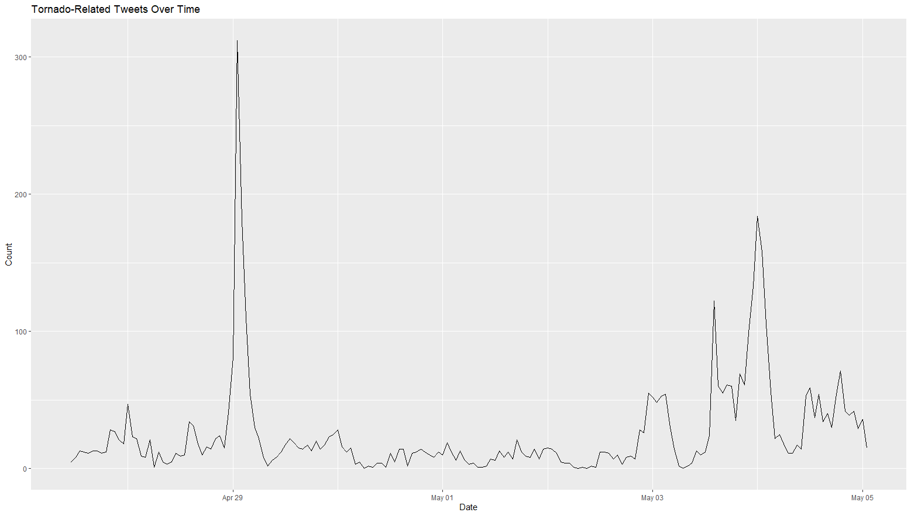
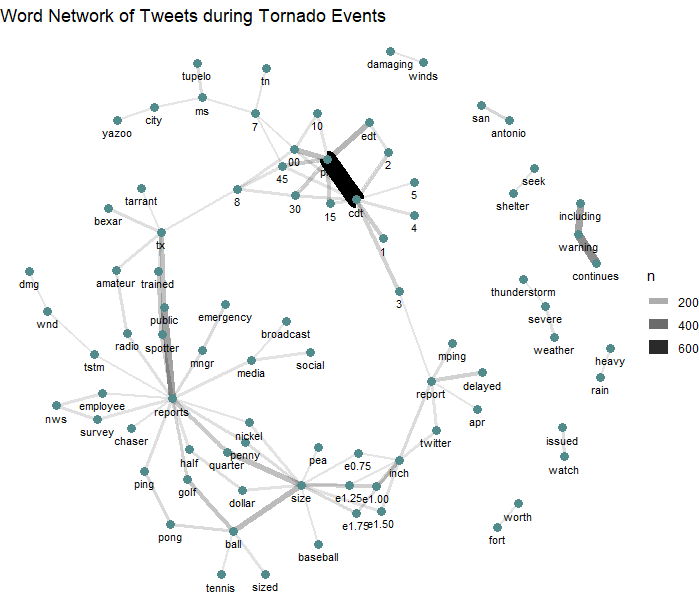
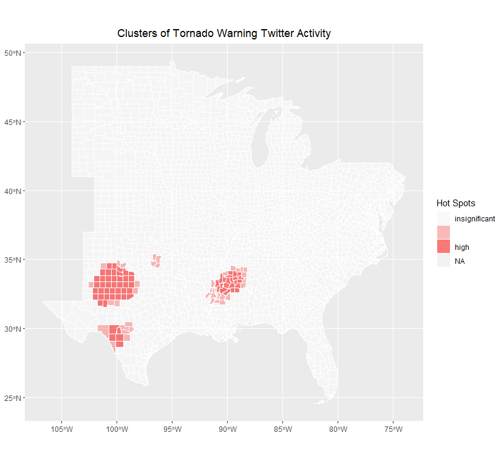
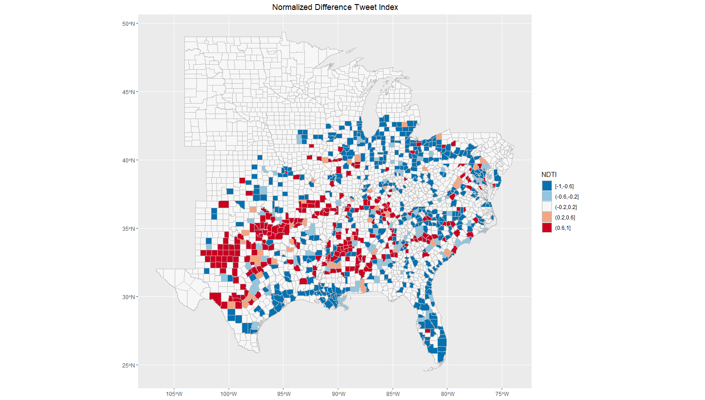

**Replication of**
# Spatial, temporal and content analysis of Twitter data

Original study *by* Wang, Z., X. Ye, and M. H. Tsou. 2016. Spatial, temporal, and content analysis of Twitter for wildfire hazards. *Natural Hazards* 83 (1):523–540. DOI:[10.1007/s11069-016-2329-6](https://doi.org/10.1007/s11069-016-2329-6).
and
First replication study by Holler, J. 2021 (in preparation). Hurricane Dorian vs Sharpie Pen: an empirical test of social amplification of risk on social media.

Replication Author:
Sam Marshall

Replication Materials Available at: [github repository name](github repository link)

Created: `10 May 2021`
Revised: `11 May 2021`

## Abstract

Why study the spatial distribution of Twitter data?

Wang et al (2016) analyzed Twitter data for wildfires in California, finding that the social media data can provide useful insights into the spatial and temporal distribution of wildfires and fire-related hazards.

Holler (2021) is studying Twitter data for Hurricane Dorian on the Atlantic coast, finding that in spite of trending news and social media content regarding a false narrative of risk, original Tweets still clustered significantly along the real hurricane track, and only along the hurricane track.

Reproducing and replicating spatial research of Twitter activity during natural disasters continues to be relevant because the circumstances surrounding each natural disaster vary greatly and the role of social media in disaster reaction and response is rapidly evolving. In this replication study, I use Holler's methods to analyze Twitter activity related to a [tornado outbreak](https://www.nytimes.com/2021/05/03/us/tornadoes-mississippi-atlanta.html) that impacted the southeastern United States from May 2 - May 4 2021. While this event gained some national news coverage, it did not occupy national attention in the way that Hurricane Dorian did. In this study I seek to investigate whether or not this relative difference in prominence impacted the spatial distribution of Twitter activity related to the event, finding that geotagged Twitter activity related to the tornado events was dominated by automatic weather alert updates that may not reflect the actual spatial and temporal distribution of the storms or their impacts.

## Original Study Information

Holler (2021) loosely replicated the methods of Wang et al (2016) for the case of Hurricane Dorian's landfall on the U.S. mainland during the 2019 Atlantic Hurricane season. Data used by Wang et al. (2016) was based on Twitter Search API queries for fire, wildfire, Bernardo, and San Marcos within a 40 mile radius of downtown San Diego from May 13 to May 22, 2014. After cleaning the tweet content, the authors identified the most frequent words and used k-means clustering to identify the most common groups of words, finding that the most common tweet content was related to reporting fire damage and extent and thanking first responders. To analyze networks of information flow, the authors built a network graph based on retweets, finding that local news and government accounts served as hubs of information from which many other users retweeted information. Wang et al. (2016) also used kernel density estimation to analyze the spatial distribution of tweets, finding that after accounting for population tweets were largely concentrated close to the actual location of the fires.

Holler modified Wang et al's methods by not searching for retweets for network analysis, focusing instead on original Tweet content with keywords hurricane, Dorian, or sharpiegate (a trending hashtag referring to the storm). Holler modified the methodology for normalizing tweet data by creating a normalized Tweet difference index and extended the methodology to test for spatial clustering with the local Getis-Ord statistic. The study tested a hypothesis that false narratives of hurricane risk promulgated at the highest levels of the United States government would significantly distort the geographic distribution of Twitter activity related to the hurricane and its impacts, finding that original Twitter data still clustered only in the affected areas of the Atlantic coast in spite of false narratives about risk of a westward track through Alabama.

Wang et al (2016) conducted their study using the `tm` and `igraph` packages in `R 3.1.2`. It is unclear what GIS software they used for spatial analysis.
The replication study by Holler (2021) used R, including the rtweet, rehydratoR, igraph, sf, and spdep packages for analysis.
This replication was conducted in R using the same packages used by Holler (2021).

## Materials and Procedure

Data collection and analysis for this replication followed Holler's methods closely. On May 4th, 2021 I searched for all tweets with the keywords tornado, hail, or storm within a 1000 kilometer radius of southwestern Tennessee (34, -87) yielding 75,442 tweets. In order to gather baseline data with which to compare the tornado data, I also searched for all tweets from the same time and area regardless of keywords, yielding 212,191 tweets. To prepare these raw data for cluster analysis, for both data sets I extracted point location information from tweets which contained it, then restricted the pool of tweets to only those with either point locations or places tagged as points of interest, neighborhoods, or cities. These more general geotags, which consist of bounding boxes containing the region in which the tweet was tagged, were reduced to their centroids. After this filtering, there were 4,651 tweets related to the tornado warnings and 12,316 baseline tweets. Complete code used to gather and preprocess the data can be accessed [here](procedure/code/01-gsm_search.R), and the complete lists of tweet ID numbers can be downloaded here: [tornado tweets](data/derived/public/tornadoids.txt), [baseline tweets](data/derived/public/baselineids.txt).

I use the same R script used by Holler (2021) to conduct the analysis for this replication, with input data and select parameters modified to account for the new context. For the tweets related to tornadoes, I graphed tweet count over time to assess the temporal distribution of Twitter activity, and extracted two-word tokens from the tweets in order to construct a network graph of associated words. The complete R script used for this component of the analysis can be accessed [here](procedure/code/02-analyze-dorian.R).

To analyze the spatial distribution of tweets, I joined both the tornado tweets and the baseline tweets to census data of population by county. This yielded a data set of tweets aggregated by county, from which I calculated the normalized difference Tweet index and the Getis-Ord hotspot statistic used by Holler (2021) to test for spatial clustering. The complete R script used for this component of the analysis can be accessed [here](procedure/code/04-spatial-clustering.R).

## Replication Results

The temporal distribution of tweets in this analysis supports the findings of Wang et al. (2016). News coverage of the tornadoes reported the most activity from May 2 - 4, while a graph of tornado-related tweets over time (fig. 1) shows a spike from May 3 - 4. This matches the original study's finding that activity spikes the day after a natural disaster. However, the largest spike in activity appears on April 29, well before the majority of tornado events. A cursory investigation of the tweets from this time and [news reports](https://spectrumlocalnews.com/tx/south-texas-el-paso/weather/2021/04/29/texas-storm-reports-from-april-28-29-severe-weather) suggests that this spike may be due to severe thunderstorms, hail, and tornado warnings around Fort Worth and San Antonio, Texas. This may indicate that the spatial  distribution of population has meaningful impacts on the temporal distribution of Twitter activity related to natural disasters, since the large populations impacted by storms and warnings in Texas on April 29 seem to have produced much more activity than the smaller, more rural populations impacted by more severe tornadoes on May 2 - 4.

_**Figure 1:** Tornado related tweets by day for the study period_

The content analysis reveals that in the case of tornado activity, automatic weather alert bots contribute a significant amount of Twitter activity. The most common word pair was 'PM' and 'CDT' (fig. 2), which are almost exclusively found in date tags for National Weather Service updates. Selecting tweets containing the keyword "CDT" from the original pool of 4,651 tweets yielded 975 tweets, which suggests that around twenty percent of the total data set came from weather alert bots. Grouping this subset of the data by the source account supports this conclusion: of 975 tweets containing "CDT", only 7 came from personal accounts (i.e. "Twitter for iphone"); the remainder originated from NWS tornado warnings (350 tweets), iembot (a family of accounts that parrots NWS alerts, 493 tweets), and a family of accounts called "Svr Wx Impact Graphics" (125 tweets total).

_**Figure 2:** Network graph of word associations, revealing a large number of tweets coming from weather alert bots_

This replication produced mixed but largely unclear results showing spatial clustering of Twitter activity related to tornado warnings. Comparing the map in figure 3 to news reports of the event indicates that the hotspot analysis may have accurately reported tornado activity in northern Mississippi, but it is unclear whether or not the other two major clusters in west Texas are related to specific storm events, and the cluster analysis did not show any other locations of significant activity despite news reports indicating multiple tornadoes across the south over this time period. In this respect, the normalized difference tweet index (fig. 4) may provide a more nuanced view of tornado-related Twitter activity, though this metric is untested for social media analysis. Ultimately, limited conclusions can be drawn from either the statistical hotspot test or the NDTI without comparing them to the actual reported locations of tornadoes and severe storms. This was a significant failure of the design of this replication in comparison with Wang et al. (2016) and Holler (2021), since unlike the original study and first replication this study lacks detailed and clearly defined information about the location and extent of the disaster event being studied.

_**Figure 3:** The data produced few significant hotspots and no significant areas of low activity_

_**Figure 4:** The NDTI metric proposed by Holler (2021) shows the hotspots identified by the Getis-Ord statistic, as well as many potential areas of high and low activity that are not reflected in the hotspot map_

## Unplanned Deviations from the Protocol

Due to the lack of areas of significantly lower Twitter activity, the classification intervals and visualization of the hotspot map had to be adjusted for this replication. The remainder of the analysis proceeded in accordance with Holler (2021) without any significant deviations.

## Discussion

Contrary to Wang et al. (2016) and Holler (2021), this replication found that bots contributed significantly to Twitter activity related to tornado warnings, making up approximately 20% of the input data.

- issue of weather bots
- issue of scale with distributed, point-based phenomena like tornado outbreaks

Provide a summary and interpretation of your key findings in relation to your research question. Mention if findings confirm or contradict patterns observed by Wang et al (2016) or by Holler (2021)

## Conclusion

Restate the key findings and discuss their broader societal implications or contributions to theory.
Do the research findings suggest a need for any future research?

## References

Include any referenced studies or materials in the [AAG Style of author-date referencing](https://www.tandf.co.uk//journals/authors/style/reference/tf_USChicagoB.pdf).

### Acknowledgments

Thanks to [Emma Clinton](https://emmaclinton.github.io/) for discovering and sharing the idea of studying Twitter activity related to tornado warnings. [Joseph Holler](https://github.com/josephholler) provided the methods and code necessary to conduct the analysis.

####  Report Template References & License

This template was developed by Peter Kedron and Joseph Holler with funding support from HEGS-2049837. This template is an adaptation of the ReScience Article Template Developed by N.P Rougier, released under a GPL version 3 license and available here: https://github.com/ReScience/template. Copyright © Nicolas Rougier and coauthors. It also draws inspiration from the pre-registration protocol of the Open Science Framework and the replication studies of Camerer et al. (2016, 2018). See https://osf.io/pfdyw/ and https://osf.io/bzm54/

Camerer, C. F., A. Dreber, E. Forsell, T.-H. Ho, J. Huber, M. Johannesson, M. Kirchler, J. Almenberg, A. Altmejd, T. Chan, E. Heikensten, F. Holzmeister, T. Imai, S. Isaksson, G. Nave, T. Pfeiffer, M. Razen, and H. Wu. 2016. Evaluating replicability of laboratory experiments in economics. Science 351 (6280):1433–1436. https://www.sciencemag.org/lookup/doi/10.1126/science.aaf0918.

Camerer, C. F., A. Dreber, F. Holzmeister, T.-H. Ho, J. Huber, M. Johannesson, M. Kirchler, G. Nave, B. A. Nosek, T. Pfeiffer, A. Altmejd, N. Buttrick, T. Chan, Y. Chen, E. Forsell, A. Gampa, E. Heikensten, L. Hummer, T. Imai, S. Isaksson, D. Manfredi, J. Rose, E.-J. Wagenmakers, and H. Wu. 2018. Evaluating the replicability of social science experiments in Nature and Science between 2010 and 2015. Nature Human Behaviour 2 (9):637–644. http://www.nature.com/articles/s41562-018-0399-z.
