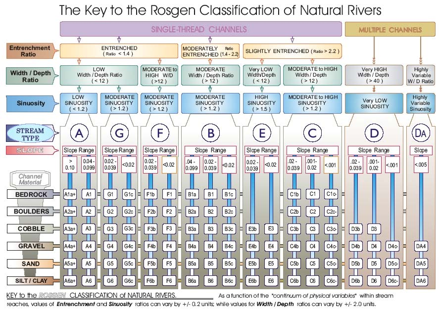

**Replication of**
# A Classification of Natural Rivers

Original study *by* Rosgen, D. L.
*in* *CATENA* 22 (3):169–199. https://linkinghub.elsevier.com/retrieve/pii/0341816294900019.

and Replication by: Kasprak, A., N. Hough-Snee, T. Beechie, N. Bouwes, G. Brierley, R. Camp, K. Fryirs, H. Imaki, M. Jensen, G. O’Brien, D. Rosgen, and J. Wheaton. 2016. The Blurred Line between Form and Process: A Comparison of Stream Channel Classification Frameworks ed. J. A. Jones. *PLOS ONE* 11 (3):e0150293. https://dx.plos.org/10.1371/journal.pone.0150293.

Replication Authors:
Sam Marshall, Zach Hilgendorf, Joseph Holler, and Peter Kedron.

Replication Materials Available at: [https://github.com/gsmarshall/RE-rosgen](https://github.com/gsmarshall/RE-rosgen)

Created: `22 March 2021`
Revised: `22 March 2021`

## Abstract

Stream classification is an important tool for understanding the geomorphic forms and processes that are present in a river system. Knowledge of a river's current condition, past history, and likely future movement makes watershed management more effective, and the need for effective stream classification is likely to grow as demand for habitat restoration, flood management, and green infrastructure increases. The Rosgen Classification System, which is one of the most widely used classification schemes in North America, uses a hierarchical workflow to classify individual stream reaches based on a variety of field measurements. This study implements a Level I and II Rosgen classification of a single section of Vinegar Creek in the Middle fork John Day Basin, a watershed with high conservation value and a thorough monitoring program from which to draw data. I aim to reproduce the classification performed by [Kasprak et al (2016)](https://dx.plos.org/10.1371/journal.pone.0150293) using primarily GIS-based methods and publicly available data. I found that my GIS based classification matched that of Kasprak et al, though gaps and errors in the workflow rendered it less robust than the field based classification and could make it difficult to scale.

## Original Study Information

[Kasprak et al (2016)](https://dx.plos.org/10.1371/journal.pone.0150293) classified 33 stream reaches in the Middle Fork John Day Basin in order to compare the efficacy of four different stream classification methods. For each classification method, the authors rely primarily on data from the [Columbia Habitat Monitoring Program](http://www.champmonitoring.org) (CHaMP), which provides detailed elevation models as well as field-based measurements of depth, width, and particle size. For the Rosgen classification, they use field measured depth, width, and mean particle size values from the CHaMP surveys as well as 10m and 0.1m resolution DEMs to calculate the metrics necessary for Level I and Level II classifications, as outlined by [Rosgen (1994)](https://linkinghub.elsevier.com/retrieve/pii/0341816294900019). The analysis code and detailed DEMs used by Kasprak et al are not publicly available, but the complete CHaMP survey data are available for download [here](assets/CHaMP_Data_MFJD.shp). This layer includes all CHaMP survey points used by Kasprak et al, all field measured data used in the classifications, and the final classification of each reach.

## Analytical Plan

Describe all elements of the analytical plan of the original study that are relevant to the research questions and hypotheses being re-examined by the replication. Include information for each of the following sub-sections as appropriate.

### Sampling Plan and Data Description

||
||
|*Figure 1: Study site detail and location within the John Day Watershed*|

I analyze a single reach of Vinegar Creek, shown above. This point was randomly selected from the 33 sites analyzed by [Kasprak et al. (2016)](https://dx.plos.org/10.1371/journal.pone.0150293), which were selected using a stratified random sampling of CHaMP survey points. Field-based measurements, including that of topographic survey DEMs, were conducted by trained technicians as part of CHaMP surveys in 2012 and 2013. Measurements involving channel cross sections were determined by averaging cross sections spaced at one meter intervals along each reach (Kasprak et al, 2016, 9). The acquisition date and lineage of other elevation data used by Kasprak et al. (2016) is unclear.

### Variables

The Rosgen Classification System uses five metrics of channel and valley form in order to classify streams: entrenchment ratio, width to depth ratio, sinuosity, slope, and median channel material size. These metrics are typically calculated from detailed field measurements conducted along a reach that is 20 times longer than the stream's bankfull width. For a complete description of each metric, see [A Classification of Natural Rivers (Rosgen1994)](https://linkinghub.elsevier.com/retrieve/pii/0341816294900019).

### Analytical Specification

[Kasprak et al. (2016)](https://dx.plos.org/10.1371/journal.pone.0150293) use the metrics and classification workflow presented by [Rosgen (1994)](https://linkinghub.elsevier.com/retrieve/pii/0341816294900019). The underlying data is drawn from CHaMP field surveys conducted in 2012 and 2013 by trained technicians. For a complete description of the analysis, see [Kasprak et al. (2016)](https://dx.plos.org/10.1371/journal.pone.0150293).

## Materials and Procedure

### Computational Environment
Kasprak et al. (2016) used the [River Bathymetry Toolkit](https://essa.com/explore-essa/tools/river-bathymetry-toolkit-rbt/) and the CHaMP Topo Toolbar to perform their analysis. I completed the GIS analysis in this replication using [GRASS GIS](https://grass.osgeo.org/) 7.8.5 and did postprocessing in [RStudio](https://rstudio.com/) using [R 4.0.4](https://www.r-project.org/); each of these environments was the most up to date stable release as of March 22 2021.

### Data description
I analyze a single reach of Vinegar Creek (loc_id = 17, Site_x = OJD03458-000536) which was randomly selected from the 33 sites analyzed by Kasprak et al. (2016). Since they require field measurement, data on river depth and mean particle size are taken from the same set of CHaMP survey points used by Kasprak et al. (2016), which is available [here](assets/CHaMP_Data_MFJD.shp). In order to make the two data sources as consistent as possible, I use the earliest available survey, which was performed in 2011 (VisitID = 135).

I use a 1-meter resolution LiDAR-derived DEM, available for download [here](assets/demShade.tif), to calculate terrain-based metrics of channel form. This data was published as part of the [Camp Creek LiDAR project](assets/2008_OLC_Camp_Creek_Acceptance_Report.pdf) and was collected between August 19 and 27, 2008. Complete information on the acquisition, processing, and accuracy of this data is available [here](assets/Camp_Creek_Lidar_Report_2008.pdf).

### Procedure
The procedure for this replication uses the same definitions of ratios and classification workflow as [Rosgen (1994)](https://linkinghub.elsevier.com/retrieve/pii/0341816294900019) (Fig. 2). In contrast with both Rosgen (1994) and Kasprak et al. (2016), this replication uses a LiDAR-derived DEM rather than field surveys to calculate terrain-based metrics of channel form. Stream and valley boundaries were digitized by hand in order to produce centerlines used to derive the length and longitudinal profile of the reach, and a single transect located near the CHaMP survey point was created in order to derive a cross-sectional profile of the reach. The elevation along the longitudinal profile and cross section was then extracted and used to calculate the necessary metrics.s

||
|*Figure 2: Level II Rosgen Classification workflow*|

The region of analysis consists of a buffer around the CHaMP survey point with a radius of 10 times the bankfull width of the stream reach as measured by the CHaMP survey. This buffer as well as visualizations of elevation and slope (Fig. 3) were created in GRASS using [a model](procedure/code/visualize.gxm) provided by [Joseph Holler](https://github.com/josephholler). Stream and valley centerlines were digitized by hand at 1:1500 scale using maps of elevation and slope to help visually identify the location of river banks and valley edges. Three sets of bank and valley boundaries, all of which extended beyond the buffer region, were created independently and then patched together and averaged in order to produce a final mean centerline (Fig. 4) for the stream and valley using [a model](assets/center_line_length_no_clip.gxm) provided by [Joseph Holler](https://github.com/josephholler). A set of transects of the valley centerline, spaced 50 meters apart, were then created, and the transect closest to the CHaMP point was selected to produce a single cross-sectional profile of the reach. This workflow was created by Zach Hilgendorf and is available [here](assets/1-Research_Protocol_GRASS.pdf)

|||
|*Figure 3a: Map of elevation at the study site*|*Figure 3b: Slope at the study site*|

|||
|*Figure 4a: Stream centerlines from each digitization and final mean centerline*|*Figure 4b: Valley centerlines from each digitization and final mean centerline*

The cross section and longitudinal profile data were then brought into R and used to calculate and visualize slope, sinuosity, width to depth ratio, and entrenchment ratio with the help of [this script](assets/2-ProfileViewer.Rmd) created by Zach Hilgendorf. The methods used to calculate these metrics are as follows:
- sinuosity: channel length / valley length
- slope: (elevation at the beginning of the reach - elevation at the end of the reach) / length of the reach
- width to depth ratio: cross-sectional width at average bankfull depth / average bankfull depth
- entrenchment ratio: cross-sectional width at 2 * maximum bankfull depth / bankfull width
- cross sectional widths were determined by inspecting the transect points and their elevations and comparing them with the graphs produced by the above R script.

The success of the replication is determined by comparing my classification of the reach with that of Kasprak et al. (2016).

## Replication Results

My analysis successfully replicated that of Kasprak et al. (2016), classifying the selected reach as C4b. With the exception of sinuosity, all of the metrics calculated in this replication fell within the ranges specified by [Rosgen (1994)](https://linkinghub.elsevier.com/retrieve/pii/0341816294900019) (Tables 2 and 3), and some closely matched those calculated by Kasprak et al. (2016) (Table 4). This correlation is less surprising for metrics that were calculated using the same CHaMP data (like width/depth and entrenchment ratios), but is also present for slope.

At 1.06, my calculated sinuosity value differs from that specified for class C streams and from that measured by Kasprak et al. (2016). This is likely due largely to a combination of errors in the process of digitizing banks and processing the stream and valley centerlines which are discussed below. However, the Rosgen Classification System allows for a deviation of &plusmn0.2 units for sinuosity values, so the C4b classification is still entirely reasonable.

Table 1. Site Measurements
All measurements are in meters unless otherwise indicated

Variable|Value|Source
---|---|---
Bankfull Width|8|cross section
Mean Bankfull Depth|0.243|CHaMP survey
Max Bankfull Depth|0.788|CHaMP survey
Valley Width|66|cross section
Valley Depth|1.58|cross section
Stream/River Length|183.51|longitudinal profile
Valley Length|173.11|longitudinal profile
Median Channel Material Particle Diameter (mm)|55|CHaMP survey

| |
|:---:|
||
|*Figure 5: Cross sectional profile of the selected transect, with the valley depth and mean bankfull depth highlighted*|

Table 2. Rosgen Level I Classification
|Criteria|Value|
|:---:|:---:|
|Entrenchment Ratio|8.3|
|Width / Depth Ratio|33|
|Sinuosity| 1.06|
|Level I Stream Type|C|

Table 3. Rosgen Level II Classification
|Criteria|Value|
|:---:|:---:|
|Slope|2.13|
|Channel Material|gravel|
|Level II Stream Type|C4b|

Table 4. Rosgen Classification Metrics from Kasprak et al. (2016)
|Criteria|Value|
|:---:|:---:|
|Slope|2.16|
|Width / Depth Ratio|30.53|
|Entrenchment Ratio|not provided|
|Sinuosity | 1.22|
|Level II Stream Type|C4b|

## Unplanned Deviations from the Protocol

Due to the location of the survey point and the size of the buffer, I was unable to clip the stream and valley centerlines to the buffer as originally planned. Since one edge of the valley lied entirely outside of the buffer (Fig. 1), doing so would have made it impossible to produce a centerline for use in the rest of the analysis. Although this change in the workflow makes the sinuosity value less consistent and less reliable - its validity is entirely dependent on how consistent the start and end of the digitized bank and valley lines are - my final bank and valley centerlines appear to start and end in similar locations (Fig. 6).

| |
|:---:|
||
|*Figure 6: Final stream and valley centerlines are roughly consistent in their start and end points*|

The R script used for postprocessing originally calculated slope by averaging the slope values at every point along the longitudinal profile of the reach. However, errors in digitizing the stream banks and artifacts in the elevation data make these values very inconsistent (Fig. 7) and artificially inflate the final slope value: using the original method yields a slope of 4.58%, while using only the start and end points of the reach yields a slope of 2.13%.

| |
|:---:|
||
|*Figure 7: Calculating slope meter-by-meter along the reach yields wildly inconsistent values*|

## Discussion

The results of this replication demonstrate the potential viability of a GIS-based stream classification method but do not present a mature, robust, and scalable methodology for implementing such a classification. While my replication of the classification done by Kasprak et al. (2016) may represent a proof of concept for future stream classification methods that rely less heavily on detailed field data, its limited spatial and temporal scale, reliance on existing field data, and gaps in its workflow make it an unreliable example of such a classification method.

Two of the most obvious sources of error and inconsistency in this study are the reliance on hand digitization done by an untrained student (myself) and the subsequent inability to clip the digitized banks and valley lines to ensure they cover the exact same length of stream. I am not trained as a geomorphologist and do not have much experience interpreting elevation or slope maps, and it was difficult at times for me to identify stream features and decide how to digitize them. While the use of three independent sets of digitized banks mitigates this to some degree, it is still likely a significant source of error and could present a barrier to implementing this methodology at scale in a consistent and cost-effective way. Furthermore, not ensuring the stream and valley boundaries cover the same reach makes the sinuosity metric incredibly unreliable. In this study they ended up being similarly placed partly by luck and partly because of how I digitized each set of features, but there was nothing in the workflow to ensure this was the case. A more reliable and scalable workflow would likely ensure that each set of features covered the exact same reach through some sort of clipping operation in a GIS.

The temporal scale of the input data used in this study also introduces uncertainty. While the LiDAR data were acquired in 2008, the earliest CHaMP surveys present in the data did not occur until 2011, and Kasprak et al. (2016) use data from 2012 and 2013 in their analysis. Rivers are extremely dynamic and can change dramatically in this time period, and this decreases the likelihood that the classification will be accurate with respect to either the river conditions as of 2008 or the Kasprak analysis from 2012 - 2013. The amount of uncertainty introduced here is partly random and partly a function of the stream type (since some stream forms naturally change faster than others), but is difficult to predict in either case. A consistent and reliable classification would require more temporally consistent data.

## Conclusion

This study successfully reproduced [Kasprak et al. (2016)](https://dx.plos.org/10.1371/journal.pone.0150293) in performing a Rosgen classification of a single reach of Vinegar Creek using GIS-based methods and publicly available data. While the final classification output of this study was consistent with that of Kasparak et al. (2016), errors and inconsistencies in the methodology would hinder its broader application. However, with revisions to the workflows, robust testing, and reliable data, similar methods could potentially be used to assess stream conditions efficiently at a larger scale.

## References

Kasprak A, Hough-Snee N, Beechie T, Bouwes N, Brierley G, Camp R, et al. (2016) The Blurred Line between Form and Process: A Comparison of Stream Channel Classification Frameworks. PLoS ONE 11(3): e0150293. https://dx.plos.org/10.1371/journal.pone.0150293

Rosgen DL. A Classification of Natural Rivers. Catena. 1994; 22:169–199. https://linkinghub.elsevier.com/retrieve/pii/0341816294900019

## Data and Code Availability

All data and code used in or produced by this analysis is publicly available and can be accessed via github repository [here](https://github.com/gsmarshall/RE-rosgen).

####  Report Template References & License

This template was developed by Peter Kedron and Joseph Holler with funding support from HEGS-2049837. This template is an adaptation of the ReScience Article Template Developed by N.P Rougier, released under a GPL version 3 license and available here: https://github.com/ReScience/template. Copyright © Nicolas Rougier and coauthors. It also draws inspiration from the pre-registration protocol of the Open Science Framework and the replication studies of Camerer et al. (2016, 2018). See https://osf.io/pfdyw/ and https://osf.io/bzm54/

Camerer, C. F., A. Dreber, E. Forsell, T.-H. Ho, J. Huber, M. Johannesson, M. Kirchler, J. Almenberg, A. Altmejd, T. Chan, E. Heikensten, F. Holzmeister, T. Imai, S. Isaksson, G. Nave, T. Pfeiffer, M. Razen, and H. Wu. 2016. Evaluating replicability of laboratory experiments in economics. Science 351 (6280):1433–1436. https://www.sciencemag.org/lookup/doi/10.1126/science.aaf0918.

Camerer, C. F., A. Dreber, F. Holzmeister, T.-H. Ho, J. Huber, M. Johannesson, M. Kirchler, G. Nave, B. A. Nosek, T. Pfeiffer, A. Altmejd, N. Buttrick, T. Chan, Y. Chen, E. Forsell, A. Gampa, E. Heikensten, L. Hummer, T. Imai, S. Isaksson, D. Manfredi, J. Rose, E.-J. Wagenmakers, and H. Wu. 2018. Evaluating the replicability of social science experiments in Nature and Science between 2010 and 2015. Nature Human Behaviour 2 (9):637–644. http://www.nature.com/articles/s41562-018-0399-z.
