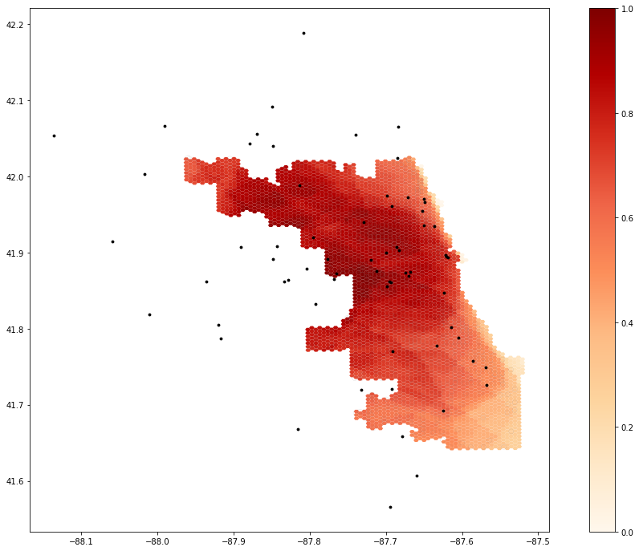
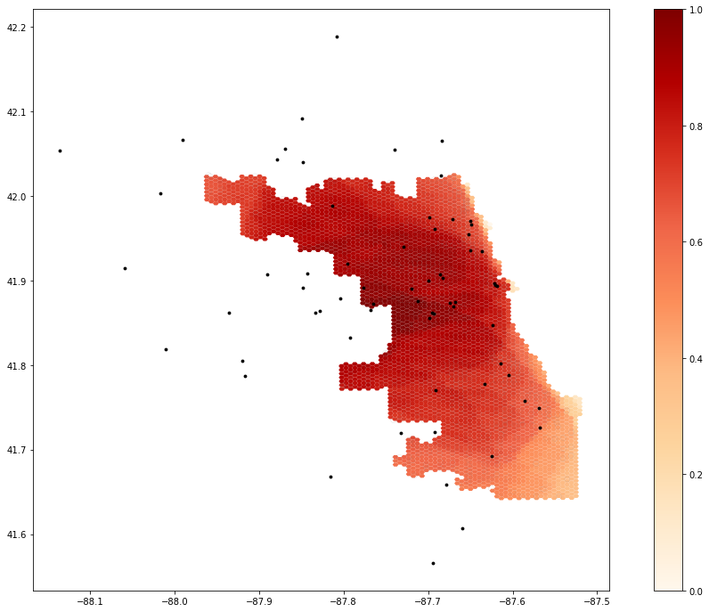

**Replication of**
# Rapidly Measuring Spatial Accessibility of COVID-19 Healthcare Resources: A Case Study of Illinois, USA

Original study *by* Kang, J. Y., A. Michels, F. Lyu, Shaohua Wang, N. Agbodo, V. L. Freeman, and Shaowen Wang. 2020. Rapidly measuring spatial accessibility of COVID-19 healthcare resources: a case study of Illinois, USA. *International Journal of Health Geographics* 19 (1):1–17. DOI:10.1186/s12942-020-00229-x.

Replication Author:
Sam Marshall

Replication Materials Available at: [gsmarshall/RP-Kang](https://github.com/gsmarshall/RP-Kang)

Created: `19 May 2021`
Revised: `19 May 2021`

## Introduction

Kang et al. (2020) completed an analysis of healthcare accessibility during the COVID-19 pandemic in Illinois, and specifically in Chicago. Their goal was to create a computationally efficient, open source, reproducible method of quantifying variability in access to healthcare resources that could be used to monitor accessibility and help allocate resources in real time during a crisis such as COVID-19.

This study aims to reproduce Kang et al. (2020) using the code and data published along with their report. Reproducing studies in this way is important because it helps verify the results of the original paper, promotes critical examination of the studies' methods, and contributes to the burgeoning practice of open science. Healthcare accessibility is a complex, widespread, and urgent issue, and reproducing studies such as this one contributes to the creation of robust and accurate methods for analyzing healthcare accessibility.

## Materials and Methods
briefly explaining and citing what data sources and computational resources were used for the study. The length/depth of this explanation may be similar to your review of the Twitter for Wildfire Hazards paper (Wang et al 2016). Explain any changes you made to the original python notebook / repository.

### Data and Computational Resources

Kang et al. (2020) completed their analysis using python in a Jupyter notebook, using the pandas, numpy, geopandas, networkx, osmnx, shapely, matplotlib, tqdm, folium, and multiprocessing packages. Included in the notebook are hospital location and service data from the Illinois department of Public Health, population data by census tract and zip code from the U.S. Census, and road network data from OpenStreetMap. The census and hospital data included in the notebook are already preprocessed to remove extraneous data, while the road network data can be accessed and cleaned from the notebook if needed.

### Methods

The original authors use an enhanced two-step floating catchment area to calculate accessibility on a hexagonal grid. First, they calculate the service-to-population ratio for each hospital in the study region by summing the population of all zip codes whose centroids lie within a fixed size catchment, which in this study represents all regions within 30 minute driving distance of each hospital. Available service at each hospital is a variable input to their model and can be represented by the number of beds or ventilators at each hospital. Population at this step is weighted by three distance zones of 10, 20, and 30 minutes driving time.

Next, they disaggregate these results onto a grid of hexagons. For each cell in the grid, if it has greater than 50% overlap with a hospital catchment, that catchment's service-to-population ratio is weighted by the cell's distance from the hospital using the same set of weights used above for the service-to-population ratio and added to a list of accessibility values for the cell. Finally, the total accessibility of each cell is calculated as the sum of all of the individual accessibility values for hospital catchments it lies within.

### Changes to Methods in this Reproduction

The code notebook used for the original study calculated accessibility at a coarse resolution for the state of Illinois as well as at a finer resolution for Chicago. This version of the repository was modified by [Joseph Holler](https://github.com/josephholler) in order to fix a bug introduced by the large volume of data needed to complete the analysis for all of Illinois, and this modified version, which only calculated accessibility for Chicago, was used in this reproduction.

Since the road network data in this modified version of the notebook covered only Chicago itself, it did not allow for travel routes to hospitals that left the city. Hospital points were also ascribed to the nearest node in the network, which caused hospitals outside of the city to be arbitrarily moved to the nearest node of the city's road network. These errors are mitigated in this reproduction by modifying the road network to include a 20 mile buffer around the city. Small erors in the formatting of at least one speed limit entry in this expanded data prevented the code from running as-is, so the speed limits for these edges in the graph are ascribed a limit of 35 mph, as is done for edges with an unknown speed limit. Thank you to [Maja Cannavo](https://github.com/majacannavo) for sharing this patch.

In their report, Kang et al. (2020) did not provide robust justification for the weight values used in their analysis. In this reproduction, I ran the analysis a second time with different arbitrary weight values of 1.0, 0.85, and 0.5 in order to get a qualitative sense for how sensitive the model might be to these weight values.

## Results and Discussion

The complete code, data, and results used for this reproduction can be accessed at [gsmarshall/rp-kang](https://github.com/gsmarshall/RP-Kang)

It is difficult to draw meaningful conclusions from a purely qualitative comparison of the outputs of this reproduction. Compared to the results provided in the notebook (fig. 1), using the same weight values but an expanded road network produced accessibility scores that were higher along the eastern edge of the city (fig. 2). Predictably, the results produced by the second set of higher weight values showed generally greater accessibility, though the reverse is true for northeastern Chicago (fig. 3). A quantitative test for the difference of these results could be useful, as might a Monte Carlo simulation to rigorously test the sensitivity of the model to changes in the weight values.

**Accessibility to Healthcare in Chicago**
 
 _**Figure 1:** Results from the original study, showing lack of accessibility in southern Chicago._

 **Mapping Accessibility with an Expanded Road Network**
  
  _**Figure 1:** When calculated using an expanded road network, accessibility values are higher along the eastern edge of the city._

  **Spatial Variation of Accessibility Changes Little with Altered Weights**
   
   _**Figure 1:** Results from the original study, showing lack of accessibility in southern Chicago._

The far more significant products of this reproduction are the addition of comments to the code notebook and the practice of reproducing research in an open science framework. The original notebook contained text before each code cell explaining the inputs and outputs to each function and briefly describing its role in the overall workflow, but neither the code itself nor these headers contained comments explaining implementation or design decisions. While the study design and most aspects of the implementation are explained fairly well in the report, comments linking the code to the report can help tie the two together and make it easier to understand both the study design and its implementation in code. This would also help fill in any gaps left by considering only the code and narrative: in some instances, such as cleaning the road network and modifying hospital locations, the code contains language-specific syntax that is difficult to understand or functions that are not mentioned in the report. Thorough comments would mitigate these issues and make the code more accessible and easily understood by a wide audience.

The idea of code as text is inherent in most practices of open science and discussions about the accuracy of code, and is increasingly being advocated for by educators and researchers hoping to expand the efficacy and practice of open source science (Rey 2009). However, in my opinion it is important to remember that considering code as text means recognizing code as ambiguous and contested, and using narrative comments to highlight and mitigate this fact. Code itself certainly is text in that at its core it is a way to communicate ideas, but in the eyes of most people it carries more authority and certainty than written or spoken language. For this reason, I believe that it is important to justify implementation and design decisions _within the code_ in order to highlight these contested decisions and transparently acknowledge the uncertainty that gets papered over by the deterministic nature of code. This will help preserve the context and lineage of the data and knowledge produced by the research, and in doing so can contribute to the practice of research ethnography as described by Nadine Schuurman (2008).

## Conclusions

The original study produced by Kang et al. (2020) is a great step towards reproducible, open science research, and this reproduction highlights the challenges of producing quality, reproducible research in an accessible, transparent, and robust way. The publication of code and data used in the analysis, as well as pseudocode and detailed explanations of most aspects of their methods included in the report, made this study far easier to understand and reproduce than most research papers. In this reproduction I contribute to the practice of open science by using these materials to assess how reproducible the study is, adding comments linking the code to the original report, and highlighting opportunities to improve the practice of open science in the future.

### Acknowledgments

Thanks to [Joseph Holler](https://github.com/josephholler) for making sure the materials provided with the original report were ready for this reproduction, and thank you to [Maja Cannavo](https://github.com/majacannavo) for sharing her fix to a persistent error with the expanded data. Thanks also to [Hannah Rigdon](https://github.com/hrigdon98) and [Brooke Laird](https://github.com/brookelaird) for ideas and emotional support during lab.

### References

Kang, J. Y., A. Michels, F. Lyu, Shaohua Wang, N. Agbodo, V. L. Freeman, and Shaowen Wang. 2020. Rapidly measuring spatial accessibility of COVID-19 healthcare resources: a case study of Illinois, USA. *International Journal of Health Geographics* 19 (1):1–17. DOI:10.1186/s12942-020-00229-x.

Rey, S. J. 2009. Show me the code: spatial analysis and open source. Journal of Geographical Systems 11 (2):191–207. http://dx.doi.org/10.1007/s10109-009-0086-8

Schuurman, N. 2008. Database Ethnographies Using Social Science Methodologies to Enhance Data Analysis and Interpretation. Geography Compass 2 (5):1529–1548. 10.1111/j.1749-8198.2008.00150.x
